# ESP32-USB-METER 上位机 使用说明书

> 截至版本：v2.6.0 | 适用平台：Windows 10/11

---

## 目录

- [1. 软件简介](#1-软件简介)
- [2. 安装与启动](#2-安装与启动)
- [3. 界面说明](#3-界面说明)
- [4. 串口连接](#4-串口连接)
- [5. 设备控制](#5-设备控制)
- [6. 阈值设置](#6-阈值设置)
- [7. 曲线采集](#7-曲线采集)
- [8. 离线数据查看](#8-离线数据查看)
- [9. 固件更新](#9-固件更新)
- [10. 驱动安装](#10-驱动安装)
- [11. 数据导出](#11-数据导出)
- [12. 主题切换](#12-主题切换)
- [13. 常见问题](#13-常见问题)

---

## 1. 软件简介

ESP32-USB-METER 上位机是一款基于 Electron 开发的桌面端工具软件，用于与 ESP32 USB 功率计设备进行串口通信，实现实时测量数据显示、曲线绘制、数据导出和固件更新等功能。

### 主要功能

| 功能 | 说明 |
|------|------|
| 串口通信 | 支持多种波特率（最高 921600），实时双向数据传输 |
| 实时曲线 | 电压、电流、功率、CPU 温度等多参数实时图表 |
| 设备控制 | 屏幕亮度、屏幕方向、采样率远程设置 |
| 阈值告警 | 可设置充放电起止电压/电流阈值 |
| 数据导出 | 保存数据为 CSV 格式，曲线保存为 PNG 图片 |
| 离线数据查看 | 列出/导出/查看设备 SPIFFS 离线记录，支持统计与 CSV 导出 |
| 固件更新 | 内置 esptool-js 烧录引擎，支持固件烧录和 Flash 擦除 |
| 主题切换 | 支持亮色/暗色主题，可跟随系统设置 |
| 日志记录 | 串口日志和操作日志保存功能 |

---

## 2. 安装与启动

### 2.1 环境要求

- 操作系统：Windows 10 或 Windows 11（64 位）
- 硬件：至少一个可用 USB 端口
- 驱动：ESP32C3 设备需安装对应 USB 串口驱动（CH340 / CP210x 等）

### 2.2 获取软件

#### 方式一：便携版（推荐）

下载 `ESP32-USB-METER-vX.X.X-portable.exe`，双击即可运行，无需安装。

#### 方式二：绿色免安装版

下载 `ESP32-USB-METER-vX.X.X-win-x64.zip`，解压到任意目录，双击 `ESP32-USB-METER.exe` 启动。

#### 方式三：源码运行

```bash
git clone <repository-url>
cd ESP32C3_USB_METER_Host
npm install
npm start
```

> **注意**：源码运行需要安装 Node.js 16+ 环境。

### 2.3 首次启动

首次启动时，Windows 可能会弹出安全警告，点击「更多信息」→「仍要运行」即可。

---

## 3. 界面说明

### 3.1 主界面（亮色主题）

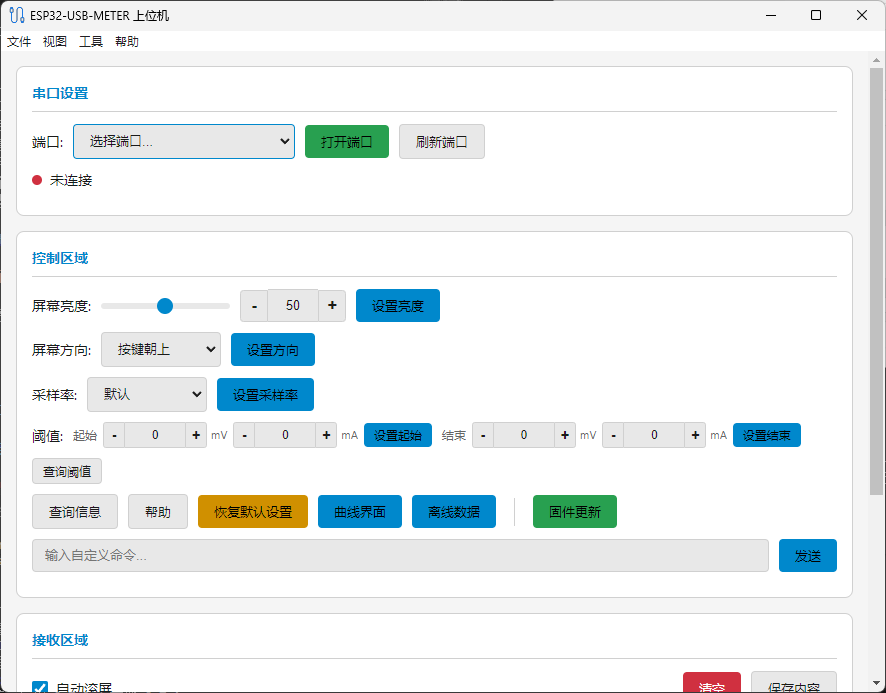

主界面分为以下几个区域：

| 编号 | 区域 | 功能 |
|------|------|------|
| ① | 串口设置 | 选择端口和波特率，打开/关闭串口连接 |
| ② | 控制区域 | 设置屏幕亮度、屏幕方向、采样率 |
| ③ | 阈值设置 | 配置充放电起止电压/电流阈值 |
| ④ | 常用命令 | 查询设备信息、恢复默认、打开曲线/固件窗口 |
| ⑤ | 自定义命令 | 发送自定义串口指令 |
| ⑥ | 日志区域 | 显示串口通信日志和操作记录 |

### 3.2 暗色主题

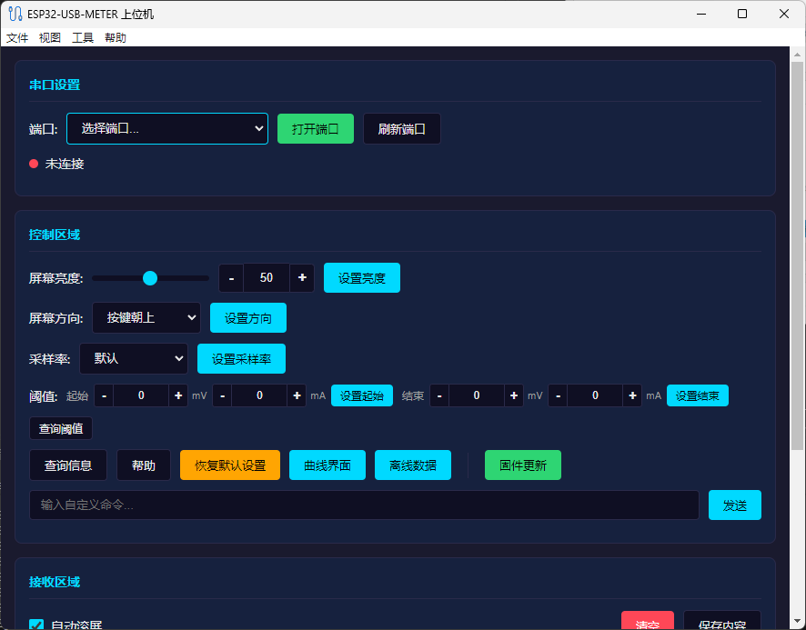

软件支持亮色/暗色主题切换，可通过菜单栏「视图 → 主题」进行设置，也可设置为「跟随系统」。

---

## 4. 串口连接

### 4.1 连接设备

1. 使用 USB 数据线将 ESP32C3 功率计连接至电脑
2. 在软件顶部「串口设置」区域，点击 **刷新端口** 按钮扫描可用串口
3. 在「端口」下拉列表中选择对应的 COM 口
4. 选择波特率（默认 **921600**，使用USB-CDC 一般无需修改）
5. 点击 **打开串口** 按钮

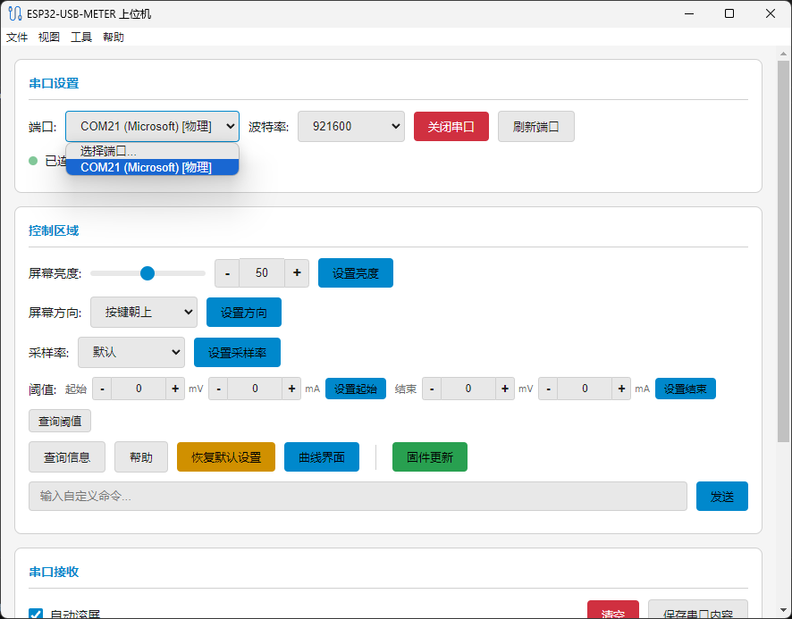

### 4.2 连接状态

- 🔴 **红色指示灯**：未连接
- 🟢 **绿色指示灯**：已连接

连接成功后，日志区域将显示 已连接到 COM端口号 @ 波特率。

### 4.3 断开连接

点击 **关闭串口** 按钮即可断开连接。关闭软件时串口会自动释放。

---

## 5. 设备控制

连接设备后，可通过「控制区域」对设备进行远程设置：

### 5.1 屏幕亮度

- 拖动滑块、输入数值或使用 +/- 按钮调整亮度值（1~100）
- 点击 **设置亮度** 将亮度值发送至设备

### 5.2 屏幕方向

| 选项 | 说明 |
|------|------|
| 按键朝下 | 屏幕旋转 0° / 180°，按键位于下方 |
| 按键朝上 | 屏幕旋转 0° / 180°，按键位于上方（默认） |

选择方向后点击 **设置方向** 即可生效。

### 5.3 采样率

通过下拉菜单选择采样率后点击 **设置采样率**。

### 5.4 常用命令

| 按钮 | 功能 |
|------|------|
| 查询设备信息 | 获取设备固件版本、采样率等基本信息 |
| 帮助 | 显示设备支持的指令列表 |
| 恢复默认 | 将所有设置恢复为固件默认值 |
| 曲线界面 | 打开实时曲线采集窗口 |
| 离线数据 | 打开离线数据查看窗口 |
| 固件更新 | 打开固件烧录窗口 |

### 5.5 自定义命令

在「自定义命令」输入框中输入指令，点击 **发送** 即可向设备发送自定义指令。

---

## 6. 阈值设置

阈值设置用于配置充放电测试的起止条件（0表示无限制）：

### 6.1 启动阈值

当电压 **高于** 启动电压 **且（AND）** 电流 **高于** 启动电流时，触发记录开始。  

> **示例**：设置启动电压 5.5V、启动电流 0.1A。当充电过程中电压升至 5.5V 以上 **且** 电流升至 0.1A 以上时，自动开始记录数据。

### 6.2 停止阈值

当电压 **低于** 停止电压 **或（OR）** 电流 **低于** 停止电流时，触发记录停止，任一条件满足即停止。  

> **示例**：设置停止电压 5V、停止电流 0.05A。当放电过程中电压降至 5V 以下 **或（OR）** 电流降至 0.05A 以下时，自动停止记录。  
>
> **说明**：停止判定采用「或（OR）」逻辑，是为了规避 PD 协议充电后期电流接近 0 而电压仍保持高位、导致计时/记录无法自动停止的问题。

### 6.3 防抖机制

起始/结束判定均带 **50ms 防抖**：条件需 **连续满足 50ms** 才会触发启停，期间若出现瞬时波动则重新计时，用于过滤电压/电流的瞬时抖动、避免误启停。

手动开始/停止记录时，会同步复位防抖计时，避免残留状态导致误触发。

### 6.4 操作步骤

1. 使用 +/- 按钮或直接输入数值设置阈值
2. 点击 **设置启动** / **设置停止** 将阈值下发至设备
3. 点击 **查询阈值** 可读取设备当前阈值配置

---

## 7. 曲线采集

点击主界面「曲线界面」按钮，打开实时曲线采集窗口。

### 7.1 亮色主题

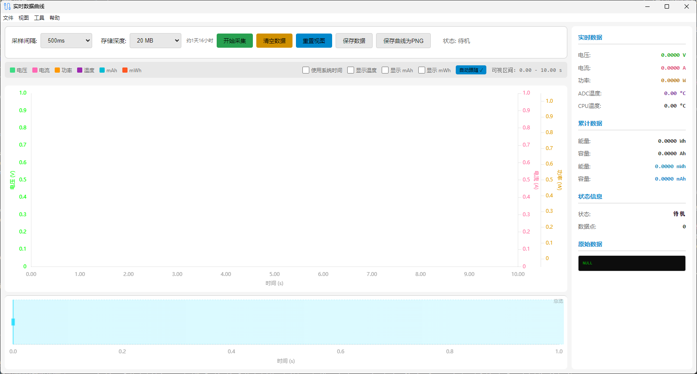

### 7.2 暗色主题

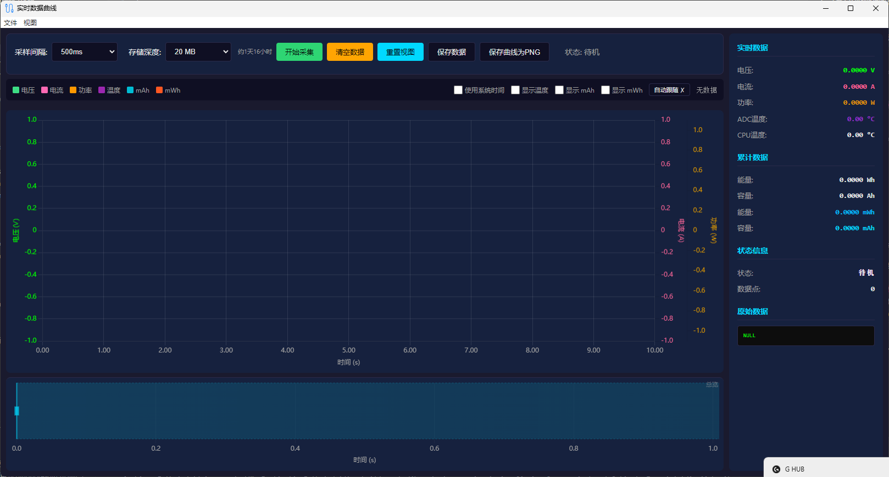

### 7.3 操作说明

| 操作 | 说明 |
|------|------|
| 选择采样间隔 | 设置数据采样时间间隔 |
| 开始采集 | 开始实时采集并绘制曲线 |
| 停止采集 | 停止数据采集 |
| 存储深度 | 设置内存预算（5~200 MB），右侧动态显示预计录制时长 |
| 缩放曲线 | 鼠标滚轮缩放，拖拽平移 |

### 7.4 显示参数

曲线窗口实时显示以下参数曲线：

- **电压** (V)
- **电流** (A)
- **功率** (W)
- **ADC 温度** (°C)
- **CPU 温度** (°C)

右侧面板显示原始数据。

---

## 8. 离线数据查看

设备的 SPIFFS 离线记录可通过本窗口读取、查看与导出。点击主界面「离线数据」按钮，或通过菜单栏「工具 → 离线数据查看」（快捷键 `Ctrl+D`）打开。

### 8.1 亮色主题

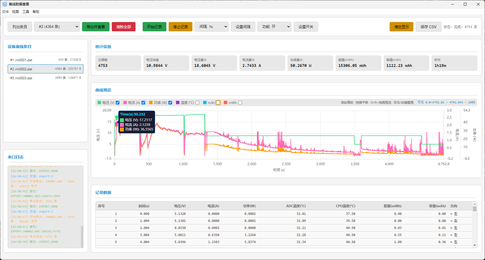

### 8.2 暗色主题

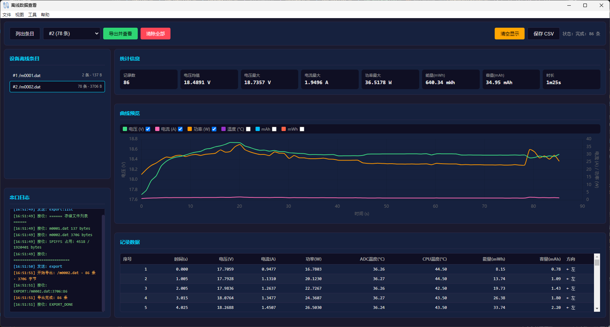

### 8.3 窗口布局

窗口左侧为「设备离线条目」列表与「串口日志」，右侧为「统计信息」、「曲线预览」与「记录数据」表格。

### 8.4 操作按钮

| 按钮 | 功能 |
|------|------|
| 列出条目 | 向设备发送 `export:list`，列出存储文件与 SPIFFS 占用 |
| 导出并查看 | 导出当前选中条目（或按编号导出）并加载显示 |
| 清除全部 | 向设备发送 `export:erase`，清除全部离线条目（不可恢复） |
| 清空显示 | 清空当前窗口已加载的数据 |
| 保存 CSV | 将当前显示的数据导出为 CSV 文件 |

### 8.5 数据展示

- **统计信息**：记录数、电压均值/最大值、电流最大值、功率最大值、能量 (mWh)、容量 (mAh)、时长
- **曲线预览**：电压、电流、功率、温度、mAh、mWh，可勾选开关各项曲线
- **记录数据表格**：序号、时间、电压、电流、功率、ADC 温度、CPU 温度、能量、容量、方向

### 8.6 快捷键

| 快捷键 | 功能 |
|--------|------|
| Ctrl+S | 保存数据为 CSV |
| F5 | 刷新列表 |

### 8.7 注意事项

- 导出前请确保主界面串口已连接
- 导出过程中请勿断开 USB 连接
- 「清除全部」会删除设备上所有离线条目，操作前请确认

---

## 9. 固件更新

点击主界面「固件更新」按钮或通过菜单栏「工具 → 固件更新」打开固件烧录窗口。

### 9.1 亮色主题

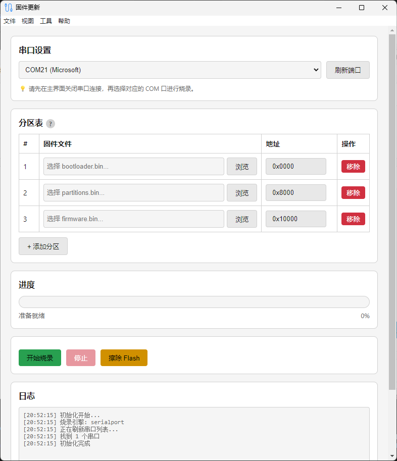

### 9.2 暗色主题

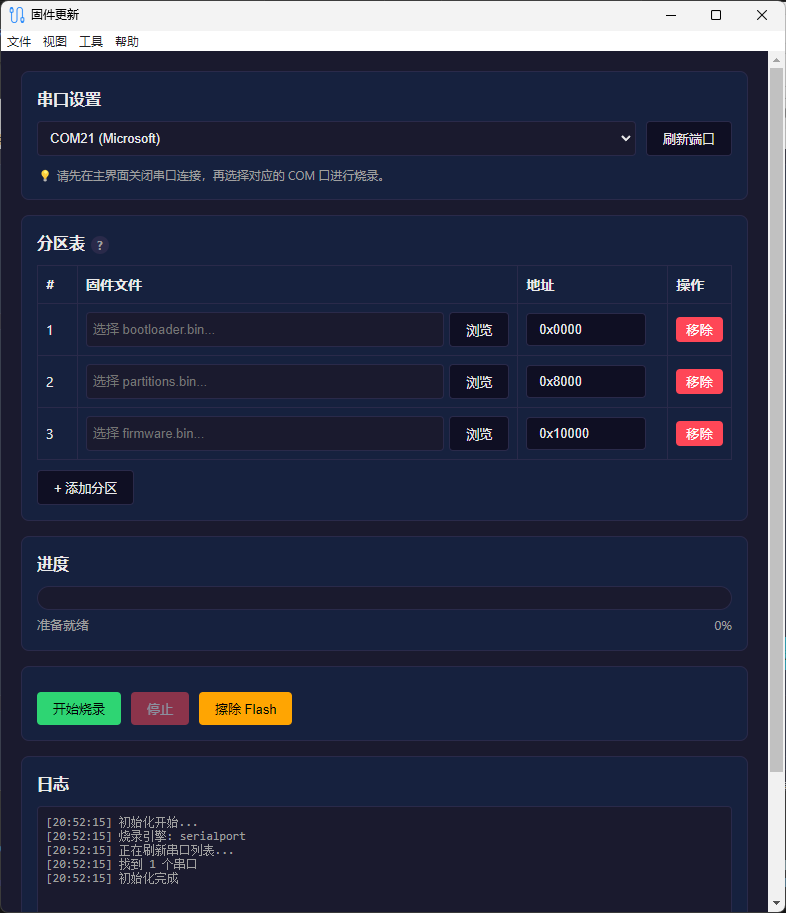

### 9.3 烧录步骤

1. **选择串口**：在固件窗口顶部选择设备对应的 COM 口
2. **加载固件**：点击三个「选择文件」按钮，分别加载：
   - **Bootloader**（`bootloader.bin`，地址 `0x0`）
   - **分区表**（`partitions.bin`，地址 `0x8000`）
   - **固件**（`firmware.bin`，地址 `0x10000`）
   > 提示：点击分区表旁的 `?` 图标可查看常用分区地址映射
   > 
   > 💡 **仅更新固件**：如果设备已烧录过 bootloader 和分区表，只需加载固件文件并填入对应地址即可，无需重复加载前三项。
3. **开始烧录**：点击「开始烧录」按钮，终端区域将实时显示烧录进度
4. **等待完成**：烧录完成后设备将自动重启

### 9.4 擦除 Flash

如需完全清除设备 Flash，点击「擦除 Flash」按钮。擦除完成后需重新烧录固件。

### 9.5 注意事项

- 烧录前请确保主界面已断开串口连接（软件会自动处理）
- 烧录过程中 **请勿断开 USB 连接或关闭窗口**
- 如烧录失败，请检查 COM 口是否正确、设备是否进入下载模式

---

## 10. 驱动安装

如果系统未能自动识别 ESP32-C3 的 USB JTAG/Serial 接口，可通过本功能手动安装驱动。

### 10.1 打开驱动安装窗口

菜单栏 → **工具 → 安装驱动**

### 10.2 亮色主题

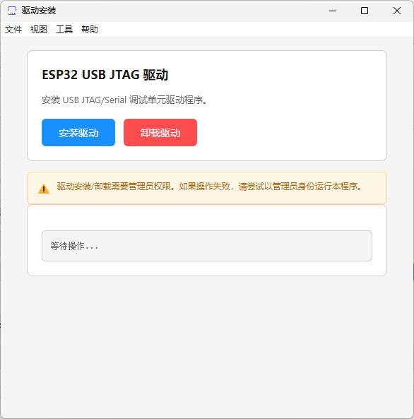

### 10.3 暗色主题

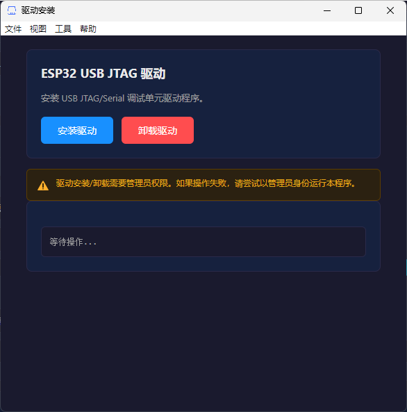

### 10.4 操作说明

| 按钮 | 功能 |
|------|------|
| 安装驱动 | 安装 ESP32-C3 USB JTAG 驱动程序到系统 |
| 卸载驱动 | 从系统中移除已安装的驱动程序 |

点击按钮后，系统会弹出 **UAC（用户账户控制）** 提权确认窗口，点击「是」后将以管理员权限执行操作。操作结果将实时显示在下方的日志区域。

### 10.5 注意事项

- 驱动安装/卸载需要**管理员权限**，请在弹出的 UAC 窗口中确认
- 安装成功后，重新插拔 USB 设备即可生效
- 如果操作失败，请尝试以管理员身份运行本程序

---

## 11. 数据导出

### 11.1 保存曲线为 PNG

菜单栏 → **文件 → 保存当前曲线为 PNG**

将当前曲线窗口截图保存为 PNG 图片。

### 11.2 保存数据为 CSV

菜单栏 → **文件 → 保存数据为 CSV**

将采集的原始数据导出为 CSV 格式，可用 Excel 打开分析。

### 11.3 导出操作日志

菜单栏 → **文件 → 导出操作日志**

将日志区域的操作记录导出为文本文件。

---

## 12. 主题切换

通过菜单栏「视图 → 主题」切换界面主题：

| 选项 | 说明 |
|------|------|
| 亮色 | 强制使用亮色主题 |
| 暗色 | 强制使用暗色主题 |
| 跟随系统 | 根据 Windows 系统主题自动切换（默认） |

---

## 13. 常见问题

### Q1：串口列表为空，找不到设备？

- 检查 USB 数据线是否支持数据传输（部分线缆仅支持充电）
- 确认已安装正确的串口驱动（CH340 / CP210x），可以在驱动安装界面安装
- 点击「刷新端口」重新扫描
- 尝试更换 USB 端口

### Q2：连接后无数据或数据乱码？

- 确认波特率设置为 **921600**
- 检查设备固件版本是否与上位机匹配
- 尝试重新插拔 USB 后重连

### Q3：固件烧录失败？

- 确认主界面串口已断开
- 检查固件文件是否正确（bootloader / partitions / firmware）
- 确认烧录地址正确：
  - Bootloader → `0x0`
  - 分区表 → `0x8000`
  - 固件 → `0x10000`
- 尝试先「擦除 Flash」再烧录

### Q4：曲线窗口中文显示异常？

- 曲线窗口使用微软雅黑字体，请确保系统已安装该字体
- Windows 10/11 默认已包含微软雅黑

### Q5：如何查看软件版本？

- 菜单栏 → **帮助 → 关于**
- 对话框将显示版本号和版本说明

### Q6：安装驱动失败？

- 退出软件右键使用管理员运行
---

## 技术规格

| 项目 | 规格 |
|------|------|
| 通信接口 | USB 串口 (UART) |
| 默认波特率 | 921600 |
| 数据格式 | 二进制数据包 (44 字节/帧) |
| 支持系统 | Windows 10/11 (x64) |
| 开发框架 | Electron 28 |
| 图表引擎 | Chart.js 4 |
| 烧录引擎 | esptool-js |

---

> 如有问题或建议，欢迎提交 Issue。
